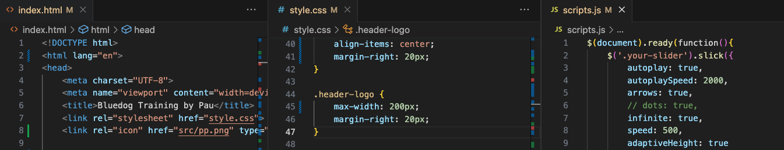

### What better way to showcase one's eagerness and passion than by creating projects? 

This entire website, including the machine learning implementation, is all about passion, drive, and a desire to show what I'm capable of. 💪🏻
So, in my spare time, I decided to apply previous knowledge and experiences, as well as new tools. To demonstrate my versatility, I opted to build this website from scratch, covering everything from frontend, database management, backend, to the final production deployment. 
The entire project was created in just two and a half days, 🫠 from the idea to its web deployment. 
The goal wasn't perfection, but rather **to practice, prove my commitment** to what I set out to do, and affirm that this truly is where I'd love to be.

The website is simple and basic, structured in **HTML** with **CSS** for styling and **JavaScript**. 

The offering is a *machine learning system* that provides users with course recommendations based on their preferences. The form data is sent via a **PHP** post to a **MySQL database**, where it is stored. 

Using PHP, a call is made to an **API** (using fastAPI) where *the machine learning recommendation system is deployed.* This system connects via **Phyton** to the MySQL database and retrieves the latest entry—consisting of the data provided by the user. This data is classified using a **Decision Tree model**, which then returns a recommended course. This recommendation is fetched from the API using PHP and presented to the user in a new window.

You can find the entire code un my repository <a href='httpss://www.github.com/ppaupallares'> GitGub</a>